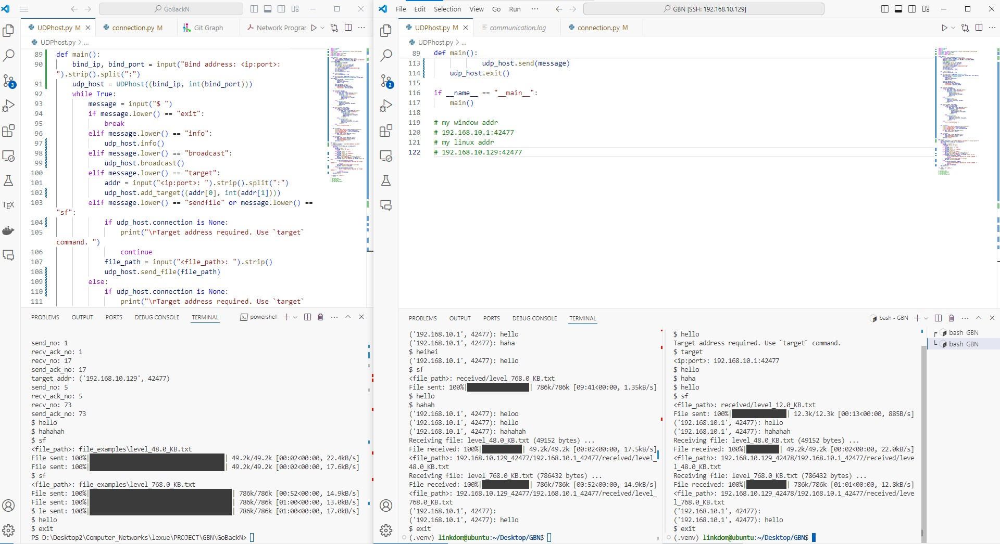

# Final Result



Multi Hosts UDP communication with Go-Back-N protocol.

- windows Host 1
- linux Host 2
- linux Host 3

## windows Host 1

```bash
PS D:\Desktop2\Computer_Networks\lexue\PROJECT\GBN\GoBackN> python .\UDPhost.py
Bind address: <ip:port>: 192.168.10.1:42477
$ target
<ip:port>: 192.168.10.129:42478
('192.168.10.129', 42478): hello
$ target
<ip:port>: 192.168.10.129:42477
$ hello
$ haha
('192.168.10.129', 42477): heihei
('192.168.10.129', 42478): haha
$ hello
$ info
Host address: ('192.168.10.1', 42477)
Target address: UDPConnection: ('192.168.10.129', 42477)
Broadcasting:  False
Target list:
target_addr: ('192.168.10.129', 42478)
send_no: 1
recv_ack_no: 1
recv_no: 3
send_ack_no: 3
target_addr: ('192.168.10.129', 42477)
send_no: 4
recv_ack_no: 4
recv_no: 2
send_ack_no: 2
Receiving file: level_768.0_KB.txt (786432 bytes) ...
('192.168.10.129', 42478): hello                      | 35.8k/786k [00:30<06:17, 1.99kB/s]
File received: 100%|███████████████████████████████████| 786k/786k [09:41<00:00, 1.35kB/s]
<file_path>: 192.168.10.1_42477/192.168.10.129_42477/received\level_768.0_KB.txt
('192.168.10.129', 42477): hello 
('192.168.10.129', 42477): hahah 
Receiving file: level_12.0_KB.txt (12288 bytes) ...
File received: 100%|███████████████████████████████████| 12.3k/12.3k [00:13<00:00, 884B/s] 
<file_path>: 192.168.10.1_42477/192.168.10.129_42478/received\level_12.0_KB.txt
$ heloo
$ info
Host address: ('192.168.10.1', 42477)
Target address: UDPConnection: ('192.168.10.129', 42477)
Broadcasting:  False
Target list:
target_addr: ('192.168.10.129', 42478)
send_no: 1
recv_ack_no: 1
recv_no: 17
send_ack_no: 17
recv_no: 73
send_ack_no: 73

send_no: 1
recv_ack_no: 1
recv_no: 17
send_ack_no: 17
target_addr: ('192.168.10.129', 42477)
send_no: 5
recv_ack_no: 5
recv_no: 73
send_ack_no: 73
$ hello
$ hahahah
$ sf
<file_path>: file_examples\level_48.0_KB.txt
File sent: 100%|█████████████████████████████████████| 49.2k/49.2k [00:02<00:00, 22.4kB/s]
File sent: 100%|█████████████████████████████████████| 49.2k/49.2k [00:02<00:00, 17.6kB/s]
$ sf
<file_path>: file_examples\level_768.0_KB.txt
File sent: 100%|███████████████████████████████████████| 786k/786k [00:52<00:00, 14.9kB/s]
File sent: 100%|███████████████████████████████████████| 786k/786k [01:00<00:00, 13.0kB/s]
$ hello
$ exit
```

## linux Host 2

```bash
(.venv) linkdom@ubuntu:~/Desktop/GBN$ python UDPhost.py 
Bind address: <ip:port>: 192.168.10.129:42477
$ target
<ip:port>: 192.168.10.1:42477
('192.168.10.1', 42477): hello 
('192.168.10.1', 42477): haha 
$ heihei
('192.168.10.1', 42477): hello 
$ sf
<file_path>: received/level_768.0_KB.txt
File sent: 100%|█████████████████| 786k/786k [09:41<00:00, 1.35kB/s]
$ hello
$ hahah
('192.168.10.1', 42477): heloo 
('192.168.10.1', 42477): hello 
('192.168.10.1', 42477): hahahah 
Receiving file: level_48.0_KB.txt (49152 bytes) ...
File received: 100%|███████████| 49.2k/49.2k [00:02<00:00, 17.5kB/s]
<file_path>: 192.168.10.129_42477/192.168.10.1_42477/received/level_48.0_KB.txt 
Receiving file: level_768.0_KB.txt (786432 bytes) ...
File received: 100%|█████████████| 786k/786k [00:52<00:00, 14.9kB/s]
<file_path>: 192.168.10.129_42477/192.168.10.1_42477/received/level_768.0_KB.txt 
('192.168.10.1', 42477):  
('192.168.10.1', 42477): hello 
$ exit
```

## linux Host 3

```bash
(.venv) linkdom@ubuntu:~/Desktop/GBN$ python UDPhost.py 
Bind address: <ip:port>: 192.168.10.129:42478
$ hello
Target address required. Use `target` command. 
$ target
<ip:port>: 192.168.10.1:42477
$ hello
$ haha
$ hello
$ sf
<file_path>: received/level_12.0_KB.txt
File sent: 100%|███████████████| 12.3k/12.3k [00:13<00:00, 885B/s]
('192.168.10.1', 42477): hello 
('192.168.10.1', 42477): hahahah 
Receiving file: level_48.0_KB.txt (49152 bytes) ...
File received: 100%|█████████| 49.2k/49.2k [00:02<00:00, 22.0kB/s]
<file_path>: 192.168.10.129_42478/192.168.10.1_42477/received/level_48.0_KB.txt 
Receiving file: level_768.0_KB.txt (786432 bytes) ...
File received: 100%|███████████| 786k/786k [01:01<00:00, 12.8kB/s]
<file_path>: 192.168.10.129_42478/192.168.10.1_42477/received/level_768.0_KB.txt 
('192.168.10.1', 42477):  
('192.168.10.1', 42477): hello 
$ exit
```